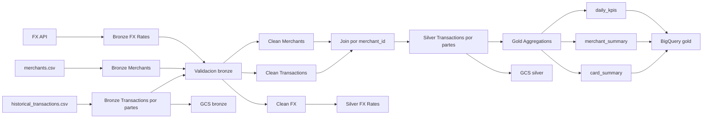
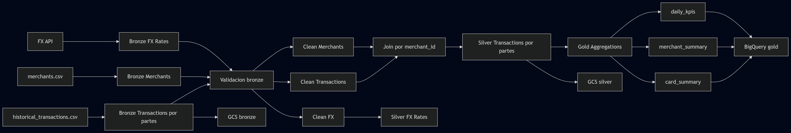

# Arquitectura del Pipeline Multicloud

## 1. Objetivo arquitectonico

El proyecto implementa un pipeline de datos orientado a la deteccion de posibles patrones de fraude financiero mediante una arquitectura medallion `bronze / silver / gold`. Su finalidad es integrar fuentes heterogeneas, estandarizarlas, validarlas y transformarlas en activos analiticos que puedan ser consultados en BigQuery y utilizados para analisis exploratorio o reglas de negocio.

La solucion se diseno para operar primero en entorno local y posteriormente proyectarse hacia una referencia cloud en Google Cloud Platform, manteniendo trazabilidad, particionamiento de archivos y una separacion clara entre capas de procesamiento.

## 2. Alcance implementado

Al momento de esta entrega se encuentran implementados los siguientes componentes:

- ingesta local a la capa `bronze`
- contratos de datos y validacion automatica
- transformaciones e integracion para la capa `silver`
- generacion de agregaciones analiticas en `gold`
- estrategia incremental basada en particiones
- backfill controlado para reconstruccion
- publicacion de referencia hacia GCS y BigQuery en GCP

## 3. Arquitectura logica

La arquitectura logica del sistema se resume en el siguiente flujo:






## 4. Descripcion de las capas

### 4.1 Bronze

La capa `bronze` funciona como zona de aterrizaje cruda. Su objetivo es conservar el significado original de los datos, aplicar una normalizacion minima de columnas y agregar metadatos de ingesta.

Responsabilidades principales:

- preservar los datos con modificaciones minimas
- normalizar nombres de columnas
- agregar columnas de trazabilidad como `source_name` e `ingest_ts`
- controlar el uso de memoria en fuentes voluminosas

Activos generados:

- `bronze/transactions/part_*.parquet`
- `bronze/bronze_merchants.parquet`
- `bronze/bronze_fx_rates.parquet`

### 4.2 Silver

La capa `silver` consolida la limpieza estructural y la integracion entre fuentes. En esta capa se aplican reglas de tipado, eliminacion de duplicados y enriquecimiento transaccional a partir del catalogo de merchants.

Responsabilidades principales:

- validar contratos de entrada
- corregir y homogeneizar tipos de datos
- eliminar duplicados
- enriquecer transacciones mediante `merchant_id`
- mantener las particiones para un procesamiento escalable

Activos generados:

- `silver/transactions/part_*.parquet`
- `silver/silver_fx_rates.parquet`

### 4.3 Gold

La capa `gold` transforma la informacion transaccional enriquecida en salidas analiticas resumidas, orientadas a la deteccion de comportamientos atipicos y al consumo desde BigQuery.

Responsabilidades principales:

- generar vistas analiticas de negocio
- conservar compatibilidad con procesamiento por particiones
- soportar ejecuciones `full`, `incremental` y `backfill`

Activos generados:

- `gold/card_summary/data.parquet`
- `gold/merchant_summary/data.parquet`
- `gold/daily_kpis/data.parquet`
- `gold/_state/processed_partitions.json`

## 5. Integracion y reglas de negocio

### 5.1 Join transaccional

La integracion principal entre transacciones y merchants se realiza mediante la clave `merchant_id`.

Decisiones tecnicas:

- clave principal: `merchant_id`
- estrategia de join: `left join`
- criterio funcional: preservar transacciones aunque no exista correspondencia en el catalogo de merchants

### 5.2 Tipo de cambio

La fuente de tipo de cambio se ingiere, valida y limpia, pero no se integra aun a las transacciones en la capa `silver`, debido a que la fuente transaccional actualmente no contiene la informacion de moneda necesaria para una conversion monetaria consistente.

## 6. Arquitectura interna de gold

La implementacion de la capa `gold` sigue una separacion modular:

- `aggregations.py`: calcula los indicadores agregados por tarjeta, comercio y dia
- `build_gold.py`: actua como punto de entrada y soporta los modos `full`, `incremental` y `backfill`
- `incremental.py`: gestiona el archivo de estado y detecta particiones nuevas
- `backfill.py`: valida y resuelve particiones a reprocesar
- `io_gold.py`: centraliza la lectura y escritura de archivos parquet

Las salidas analiticas principales son:

- `card_summary`
- `merchant_summary`
- `daily_kpis`

Estas tablas no representan un modelo predictivo de fraude, sino una base analitica sobre la cual pueden definirse reglas de negocio para identificar comportamientos atipicos, por ejemplo:

- montos acumulados inusualmente altos por tarjeta
- volumen anomalo de transacciones por comercio
- patrones diarios fuera de rango esperado

## 7. Estrategia incremental

La estrategia incremental actualmente implementada se basa en la deteccion de nuevas particiones dentro de `silver/transactions`.

Flujo:

- lectura del estado previo desde `gold/_state/processed_partitions.json`
- comparacion contra las particiones disponibles en `silver/transactions/*.parquet`
- identificacion de nuevas particiones
- reconstruccion de la capa `gold` con el conjunto actualizado
- persistencia del nuevo estado

Este enfoque ofrece una simulacion robusta de incrementalidad sin requerir aun un motor de orquestacion externo.

## 8. Implementacion de referencia en GCP

La referencia cloud actual se despliega sobre Google Cloud Platform con la siguiente configuracion:

- nombre del proyecto: `fraud-medallion-pipeline`
- project id: `arboreal-logic-493416-i6`
- region operativa: `us-east1`
- datasets BigQuery: `bronze`, `silver`, `gold`
- bucket GCS utilizado: `fraud-medallion-raw-fab`

### 8.1 Uso de GCS

Google Cloud Storage se utiliza como repositorio de archivos para las capas `bronze` y `silver`, permitiendo conservar la organizacion por carpetas y la trazabilidad de particiones.

Estructura de objetos publicada en el bucket:

```text
gs://fraud-medallion-raw-fab/fraud_medallion/bronze/
|-- bronze_fx_rates.parquet
|-- bronze_merchants.parquet
`-- transactions/
    |-- part_00001.parquet
    |-- part_00002.parquet
    `-- ...

gs://fraud-medallion-raw-fab/fraud_medallion/silver/
|-- silver_fx_rates.parquet
`-- transactions/
    |-- part_00001.parquet
    |-- part_00002.parquet
    `-- ...
```

Esta organizacion mantiene correspondencia directa con la estructura local del repositorio y facilita auditoria, reproceso y validacion manual de archivos.

### 8.2 Uso de BigQuery

BigQuery se utiliza como capa de consumo analitico final para la informacion `gold`. Las tablas publicadas son:

- `arboreal-logic-493416-i6.gold.card_summary`
- `arboreal-logic-493416-i6.gold.merchant_summary`
- `arboreal-logic-493416-i6.gold.daily_kpis`

Estas tablas constituyen la base para consultas exploratorias, monitoreo operativo y reglas de identificacion de riesgo.

## 9. Riesgos y mitigaciones

### 9.1 Cambio de estructura en la API FX

Mitigacion:

- validacion de status HTTP
- validacion de respuesta JSON
- verificacion explicita de la clave `rates`

### 9.2 Contratos desalineados respecto de las fuentes

Mitigacion:

- validacion automatica antes de persistir `bronze` y `silver`
- pruebas automatizadas sobre contratos y transformaciones

### 9.3 Estado incremental inconsistente

Mitigacion:

- ejecucion `full` como reconstruccion limpia
- backfill controlado sobre particiones existentes

## 10. Observabilidad y trazabilidad

La solucion ya contempla mecanismos basicos de observabilidad:

- logs por etapa de procesamiento
- conteo de chunks procesados en ingesta
- mensajes explicitos ante fallos de fuente o validacion
- archivo de estado para trazabilidad incremental

En conjunto, estos elementos permiten entender el estado del pipeline, reproducir ejecuciones y justificar tecnicamente la evolucion posterior hacia un entorno mas operativo.
