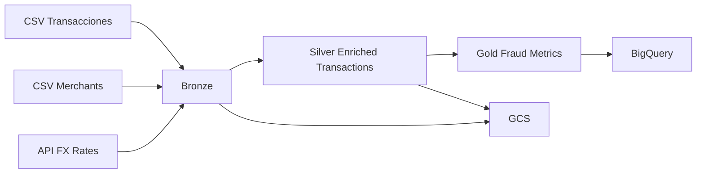

# Arquitectura del Pipeline Multicloud

## 1. Objetivo

Construir un pipeline reproducible para integrar datos de transacciones, merchants y tipo de cambio, y publicar metricas de fraude con arquitectura bronze / silver / gold.

## 2. Arquitectura logica

## 3. Capas del pipeline

### Bronze

Responsabilidad:

- ingesta de cada fuente con el menor numero posible de cambios
- trazabilidad de origen
- estandarizacion minima de columnas

Tablas:

- `bronze_transactions`
- `bronze_merchants`
- `bronze_fx_rates`

### Silver

Responsabilidad:

- limpieza de tipos
- deduplicacion
- reglas de calidad
- integracion entre fuentes
- conversion monetaria

Tabla principal:

- `silver_enriched_transactions`

### Gold

Responsabilidad:

- exposicion de metricas listas para analisis
- salida para dashboards, reportes o modelos

Tablas planeadas:

- `gold_fraud_by_category`
- `gold_fraud_by_country`
- `gold_fraud_adjusted_amount`

## 4. Modelo de integracion

### Entidades base

#### Transacciones

- granularidad: una fila por transaccion
- clave esperada: `transaction_id`

#### Merchants

- granularidad: una fila por merchant
- clave esperada: `merchant_id`

#### FX rates

- granularidad: una fila por fecha y par de monedas
- clave esperada: `rate_date + base_currency + target_currency`

### Clave de enriquecimiento

La integracion principal entre transacciones y merchants se hara por `merchant_id`.

La integracion con FX se hara por:

- fecha de compra normalizada
- moneda origen
- moneda destino objetivo

## 5. Incrementalidad

Se define una estrategia incremental por watermark local.

Estado minimo:

- archivo `state.json` en ejecucion local
- campo de control `last_processed_purchase_timestamp`

Comportamiento:

- cada corrida procesa solo datos posteriores al watermark
- si no existe estado, corre una carga completa inicial
- se habilitara backfill manual por fecha en una etapa posterior

## 6. Mapeo a servicios cloud

### GCP principal

- almacenamiento de bronze y silver: Google Cloud Storage
- almacenamiento analitico gold: BigQuery
- orquestacion futura: Cloud Composer o ejecucion programada

### AWS secundaria

- extension ligera opcional para exportar subset de `gold` a S3

## 7. Riesgos y mitigaciones

### Cambio de estructura en la API FX

Mitigacion:

- validacion de esquema
- manejo de timeout y respuesta vacia

### Faltantes en `merchant_id`

Mitigacion:

- reglas de calidad en silver
- bandera de registros no enriquecidos

### Tipos de cambio faltantes por fecha

Mitigacion:

- marcar registros no convertibles
- definir estrategia de fallback documentada en silver

## 8. Observabilidad inicial

Se dejara preparada una base minima de operacion:

- logs estructurados por etapa
- conteo de registros por fuente y capa
- errores claros al fallar contratos o joins criticos

## 9. Estado del documento

Este documento cubre el borrador funcional del Dia 1 y servira como base para ampliar transformaciones, contratos de datos, operacion en GCP y observabilidad en los siguientes dias.
